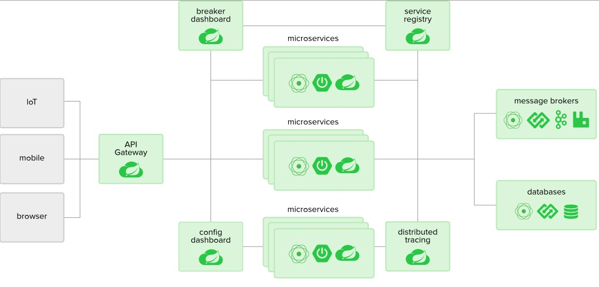

# iCommerce  

## The Story  
A small start-up named "iCommerce" wants to build a very simple online shopping application to sell their products. 
In order to get to the market quickly, they just want to build an MVP version with a very limited set of functionalities:
1. The application is simply a simple web page that shows all products on which customers can filter, sort, and search for products based on different criteria such as name, price, brand, color, ...
2. All product prices are subject to change at any time and the company wants to keep track of it.
3. A product always shows the latest price when showing on the website 
4. If the customer finds a product that they like, they can add it to their shopping cart and proceed to place an order.
5. For audit support, all customers' activities such as searching, filtering, and viewing product details need to be stored in the database. However, failure to store customer activity is completely transparent to customers and should have no impact on the activity itself.
6. Customers can log in simply by clicking the button “Login with Facebook”. No further account registration is required.
7. No online payment is supported yet. The customer is required to pay by cash when the product got delivered.


## Table of Contents  
**1. [System Architecture](#1-system-architecture)**<br>
**2. [Components](#2-components)**<br>
**3. [Entity Relationship Diagram & Data Analysis](#3-entity-relationship-diagram-&-data-analysis)**<br>
**4. [Development and Deployment Guideline](#4-development-and-deployment-guideline)**<br>
**5. [CI/CD Workflow](#5-cicd-workflow)**<br>
**6. [Next Steps](#6-next-steps)**<br>


## 1. System Architecture  
Microservices Architecture with Saga Pattern (supporting Distributed Transaction)


## 2. Components  
+ Web portal designed using Angular  


my babe will grow sexy soon ^^

+ System secured by OAuth 2 using Okta (Facebook as indentity provider). 
  
Alternative options: Keycloak, WSO2 Identity Server 


+ Distributed Transaction handled by Saga Pattern (Orchestration approach)  

Alternative options: WSO2 ESB (Enterprise Service Bus)

+ Distributed Tracing using Zipkin  


+ ELK stask for monitoring system, and user data analytics

Elasticsearch will be used for quick search feature.
User big data will be proccessed by AI for product recommendation.

+ Service Discovery using Eureka 


+ API Gateway using Spring Cloud Gateway (previously, Netflix Zuu).  
Service Discovery and Load Balancing alternatives: Kubernetes, HashiCorp Consul   

+ Dynamic Configuration using Spring Cloud Config Bus beacause we're going to have clusters with hundreds, even thounsands of nodes :)  

+ Microservices implemented with Spring Boot and Spring Cloud  


### Coding modules

+ icommerce-portal  
> iCommerce web portal  
+ icommerce-parent  
> iCommerce Parent module stores common dependencies  
+ icommerce-common  
> iCommerce Common implements common entities, functions  
+ icommerce-gateway  
> API Gateway  
+ icommerce-discovery  
> Service Registry and Discovery  
+ icommerce-core  
> Core services (will be seperated as Order service, Product service)
+ icommerce-orchestrator  
> Order Orchestrator (Saga Pattern) for Distributed Transaction  
+ icommerce-inventory  
> Inventory service  
+ icommerce-payment  
> Payment service  
+ Dockerfile, docker-compose.yml for packaging and containerization  


## 3. Entity Relationship Diagram & Data Analysis  

### 3.1. Relational Entities: Customer, Product, Order  
+ Based on the requirements, we can see that the Customer, Product, and Order data need to be consistent.  
So it's reasonable to have RDBMS handle it.  
+ Here we can use MySQL, or PostgreSQL as they're light weight, and easy to setup on dev machine.   
+ As a POC, we just use the simple structure as below 

+ Later on, we should consider MS SQL Server, or Oracle DB for more performance features, and support. Just imagine we have to handle millions of requests, or query million records per seconds 🔔

### 3.2. Data Analysis: User Behaviour, System Tracking  
+ As for User Behaviour data like searching, purchasing... we can store in Elasticsearch, MongoDB, Cassandra... for data mining, and recommendation system.
+ We can also keep track of the system health, and service calls by using Logging and Reporting system like ELK.  


## 4. Development and Deployment Guideline  

### 4.1. Prerequisites  

+ Java 11  
+ Apache Maven 3.8  
+ An Okta Developer account or a Keycloak server  

### 4.2. How To Build  

You can easily build, run, and deploy all the services as they're just plain simple Spring Cloud microservices, and Angular app.  

+ To build backend microservices, please navigate to icommerce-parent directory, and run  
```
$ mvn clean install
```

+ For iCommerce portal, go to icommerce-portal, and execute  
```
$ npm install
```

### 4.3. How To Run  

+ For backend microservices, please run the built jar file from step 1
or
build Docker image, and then run the container  

+ For icommerce-portal web app, please run dev
```
$ npm start
```
or build release package and then deploy to any HTTP server  

### 4.4. How To Deploy   

The packages can run as (1) standalone apps  
OR  
run as (2) docker containers  
OR  
can be deployed to (3) Kubernetes cluster  


## 5. CI/CD Workflow  
+ Souce code managed, and committed to Git repository  
+ Release packages built as Docker images  
+ Docker images stored at Docker Registry  
+ Kubernetes starts new instances of Docker images  
+ Jenkins for pipeline, automatic build and deployment  


## 6. Next Steps  

### 6.1. Technical Enhancements  
+ Adding Data Service component to centralize handling multiple data sources, considering WSO2 Data Services Server (DSS)  
+ Executing load test and performance test on the whole system on production-ready environment (AWS Cloud, Google Cloud). Tools: SoapUI, JMeter  
+ Performing security test on the whole system, network.
Tools: Burp Suite, Wireshark, Postman  

### 6.2. Features Improvements 
+ Implementing Product History  
+ Developing Shipping Service  
+ Introducing recommendation system (product sugguestion, best price, best buy)  
+ Integrating with CRM system for better customer interaction (events, points, coupons, vouchers...)  

That's it for now :)  
Enjoy and stay tuned for more updates!  

